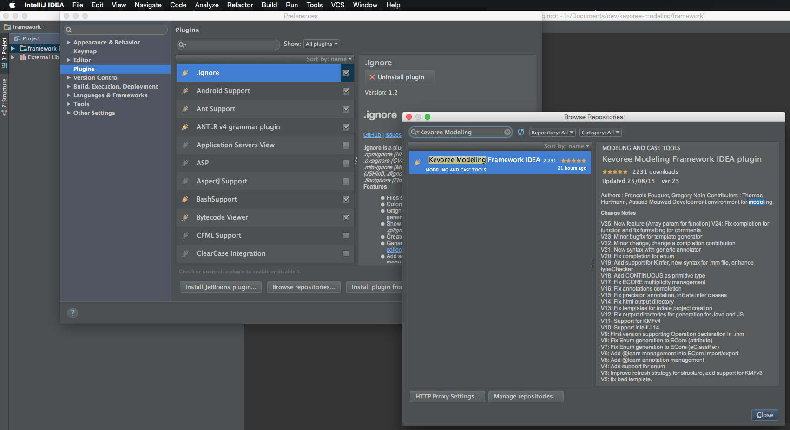
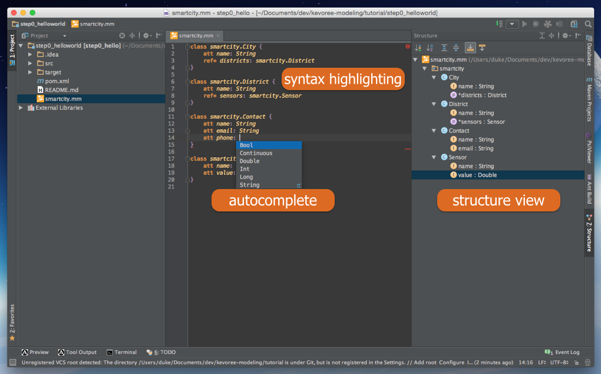

# Kevoree Modeling plugin for the IDEA development environment

This repository contains the source code of the Kevoree Modeling IDEA plugin. 

##Installation

This plugin can be dowloaded and install from the standard plugins repository of IDEA.

[Kevoree Modeling Framework IDEA plugin page](https://plugins.jetbrains.com/plugin/7504?pr=idea)

The installation procedure is summary in the following document. 
[Plugin installation procedure for IntelliJ IDEA](https://www.jetbrains.com/idea/help/installing-updating-and-uninstalling-repository-plugins.html)

In short:

go to IDEA **Preferences** *>* **Plugins** *>* **Browse repositories** *>* **Type Kevoree Modeling in the search field** *>* **click on Install Plugin**.  

##Features

In a nutshell, this plugins allows you to edit **.mm** files and launch Kevoree Modeling code generation process. Major features are the following:

- Syntax highlighting
- On-the-fly error checking
- Autocomplete *(type-aware)*
- Structure view to navigate into large MetaModel
- Reformat
- Launching of code generation for JavaScript and Java
- Project wizard
- New MetaModel file wizard

Next, a screenshot give you a taste of how it look like integrated into 

##Bug tracking
If you face a bug or have a feature request please open an issue [here](https://github.com/kevoree-modeling/idea-plugin/issues)

##Authors:
- Fouquet Francois
- Gregory Nain
- Thomas Hartmann
- Assaad Moawad

